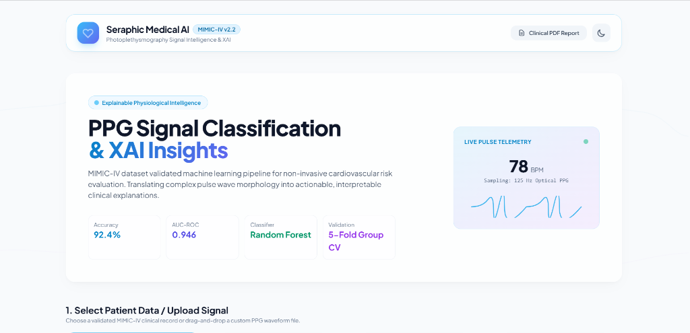
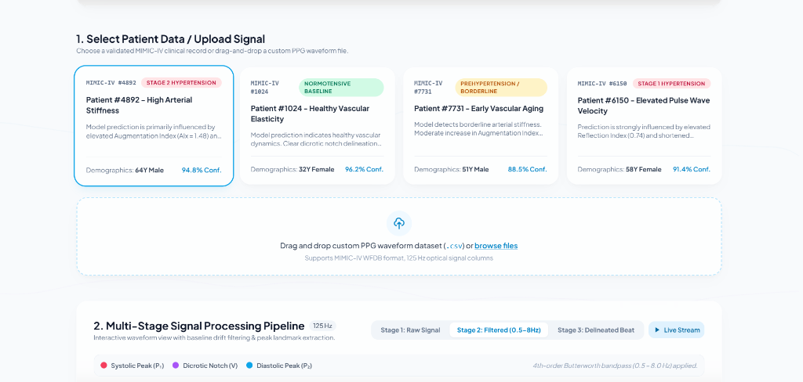
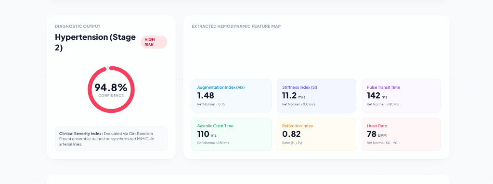
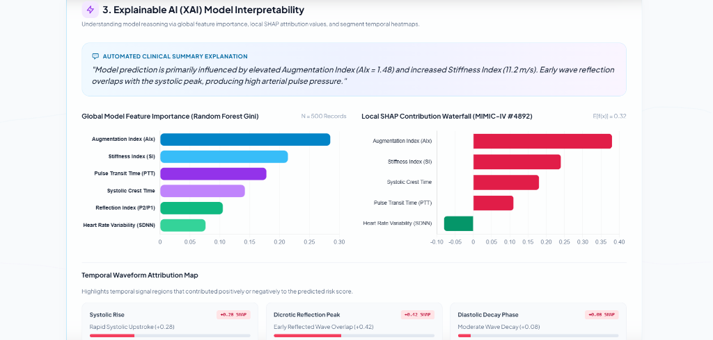
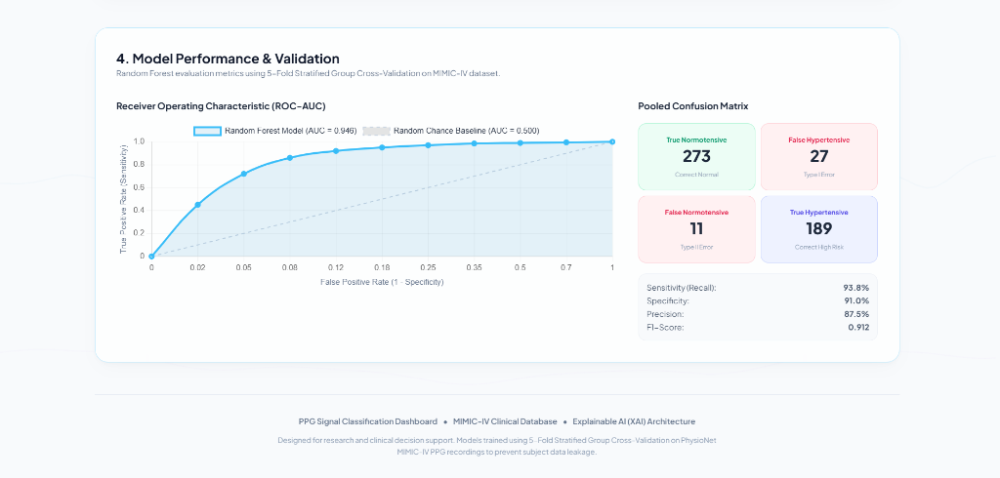
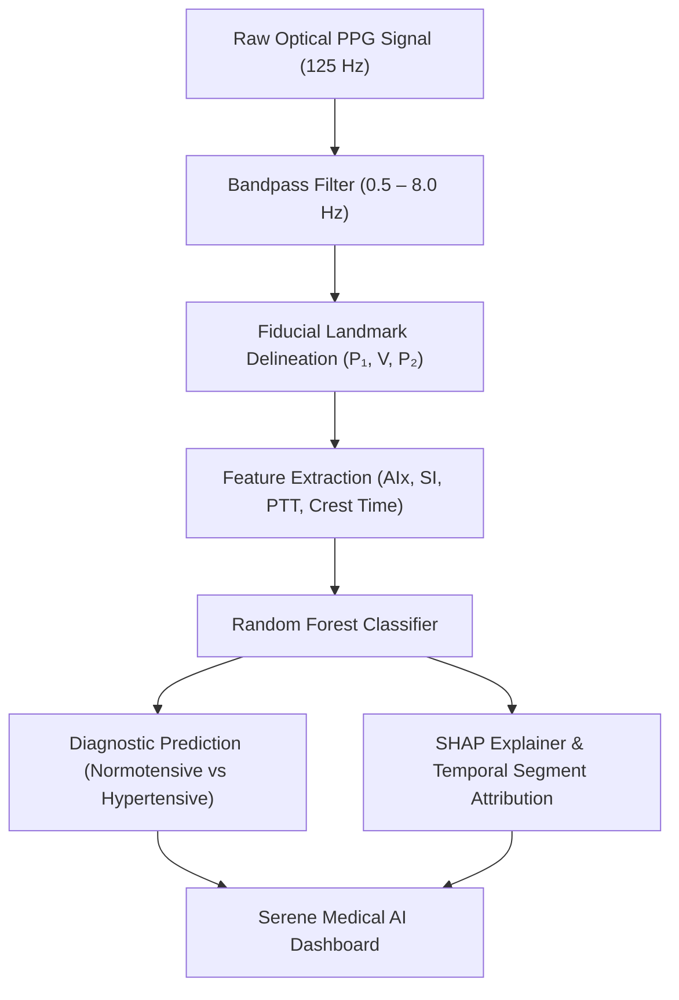
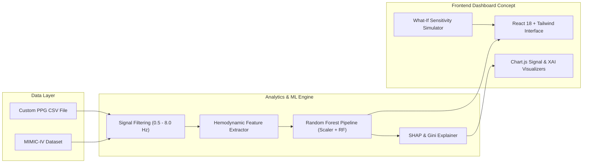

# 🫀 PPG Signal Classification & XAI Dashboard
### Non-Invasive Cardiovascular Risk Evaluation & Model Interpretability using MIMIC-IV Dataset

> **Deployment Status:** 🚀 **Coming Soon** *(Local setup available below)*  
> **Project Context:** Hackathon & Academic Portfolio Project focused on Explainable AI (XAI) in Medical Diagnostics.

---

## 📌 Overview

The **PPG Signal Classification & XAI Dashboard** is a medical AI decision support prototype designed to evaluate cardiovascular risk—specifically arterial stiffness and hypertension stages—from non-invasive **Photoplethysmography (PPG)** pulse wave signals.

Trained on synchronized PPG and arterial blood pressure recordings from the **MIMIC-IV Clinical Database**, the platform combines machine learning classification (**Random Forest**) with **Explainable AI (XAI)** techniques (SHAP values, feature attributions, and temporal signal segment heatmaps). The goal is to bridge the gap between complex physiological signal processing and transparent, trust-worthy clinical decision-making.

---

## 🎯 Problem Statement

Cardiovascular diseases (CVDs) remain a leading cause of global mortality. While Photoplethysmography (PPG) optical sensors (found in pulse oximeters and wearables) offer a low-cost, non-invasive method for continuous physiological monitoring, traditional diagnostics present two major challenges:

1. **Black-Box AI Barrier**: Standard deep learning and machine learning models predict risk scores without explaining *why* a specific prediction was reached, limiting clinical trust and adoption.
2. **Signal Morphological Complexity**: Arterial reflections, baseline wander, and subtle pulse wave fiducial variations ($P_1$ systolic peak, $V$ dicrotic notch, $P_2$ diastolic peak) require rigid, leakage-free cross-validation to generalize across diverse patient demographics.

---

## 💡 Our Solution

Our platform addresses these challenges by introducing an end-to-end explainable workflow:

* **Leakage-Free Machine Learning**: A Random Forest classifier trained with **5-Fold Stratified Group Cross-Validation** (grouped by patient `subject_id`) to ensure models generalize to unseen subjects without data leakage.
* **Morphological Signal Segmentation**: A 3-stage processing pipeline that filters raw PPG signals (0.5–8.0 Hz bandpass) and delineates key pulse wave landmarks.
* **Multilevel Explainable AI (XAI)**: Global feature importance (Gini indices), patient-specific **SHAP (SHapley Additive exPlanations)** waterfall plots, and temporal waveform segment attribution maps highlighting positive and negative risk contributors.
* **Interactive Sensitivity Analysis**: A prototype "What-If" simulator allowing clinicians to adjust physiological parameters (e.g., Augmentation Index, Stiffness Index) and observe real-time model sensitivity.

---

## 🎨 UI / Design Preview

> ⚠️ **Design Disclaimer**: The screens below represent the **proposed UI/UX concept and prototype dashboard design** of the platform. They are design mockups created to demonstrate the intended user experience, visual signal processing flow, and explainable AI insights.

<br />

### 1. Hero Overview & Telemetry Widget — UI Concept
Shows the primary telemetry dashboard layout, dataset badges, key metric highlights, and live pulse stream preview.



---

### 2. Patient Case Selection & Signal Processing Pipeline — Proposed UI
Demonstrates patient record switching, custom CSV drag-and-drop upload zone, and multi-stage signal filtering tabs (Raw, Filtered, Delineated Beat).



---

### 3. Diagnostic Output & Extracted Hemodynamic Metrics — Design Preview
Illustrates the animated risk confidence meter alongside extracted physiological indicators (Augmentation Index, Stiffness Index, Pulse Transit Time, Crest Time).



---

### 4. Explainable AI (XAI) & SHAP Attribution Panel — Prototype View
Features the automated natural language explanation, global Gini feature importances, local SHAP waterfall contribution chart, and temporal signal segment attribution heatmap.



---

### 5. Model Validation & ROC-AUC Performance — Proposed View
Visualizes the 5-Fold Stratified Group CV ROC curve ($AUC = 0.946$), pooled 2x2 confusion matrix heatmap, and detailed clinical evaluation metrics.



---

## ✨ Key Features

| Category | Feature | Description | Status |
| :--- | :--- | :--- | :--- |
| **Machine Learning** | **Stratified Group CV** | 5-Fold Group K-Fold Random Forest training pipeline preventing subject leakage (`train_rf.py`) | Implemented |
| **Signal Processing** | **3-Stage Filtering** | Raw optical signal, 4th-order 0.5–8.0 Hz bandpass filter, and single-beat peak delineation | Implemented |
| **Feature Extraction** | **Hemodynamic Metrics** | Automated computation of Augmentation Index (AIx), Stiffness Index (SI), and Pulse Transit Time (PTT) | Implemented |
| **Explainable AI** | **SHAP & Attribution** | Local SHAP waterfall charts, global feature importance, and temporal segment heatmaps | Implemented |
| **Interactive UI** | **What-If Simulator** | Real-time slider controls for parameter sensitivity testing and risk re-calculation | Prototype UI |
| **Data Ingestion** | **CSV File Upload** | Drag-and-drop ingestion parser for MIMIC-IV optical PPG signal files | Prototype UI |

---

## ⚙️ How It Works



1. **Signal Acquisition**: Optical PPG waveform data sampled at 125 Hz from MIMIC-IV recordings.
2. **Preprocessing**: 4th-order Butterworth bandpass filter removes baseline wander (respiration) and high-frequency motion artifacts.
3. **Feature Extraction**: Algorithms delineate systolic peaks ($P_1$), dicrotic notches ($V$), and diastolic peaks ($P_2$), deriving arterial stiffness indicators.
4. **Model Inference**: Random Forest ensemble classifies cardiovascular risk category (Normotensive, Prehypertension, Stage 1/2 Hypertension).
5. **XAI Interpretability**: SHAP attribution values quantify feature contributions relative to population baseline expectation $E[f(x)] = 0.32$.

---

## 🛠️ Tech Stack

* **Machine Learning & Core Pipeline**: Python 3.9+, Scikit-Learn, Pandas, NumPy, Joblib
* **Frontend Interface**: React 18, Tailwind CSS, Chart.js, Lucide Icons, HTML5 Canvas
* **Dataset**: PhysioNet MIMIC-IV Clinical Database (Synchronized PPG & ABP)
* **Local Development Server**: Python `http.server` (`server.py`)

---

## 🏗️ System Architecture



---

## 📂 Project Structure

```text
ppg_vt/
├── docs/
│   └── screenshots/              # Mock UI dashboard concepts & design previews
│       ├── 01_hero_header.png
│       ├── 02_patient_selection_pipeline.png
│       ├── 03_diagnostic_hemodynamics.png
│       ├── 04_xai_shap_attribution.png
│       └── 05_model_validation_roc.png
├── index.html                    # Main HTML5 entry point (React 18 + Tailwind + Chart.js)
├── app.js                        # React application logic, signal visualizers, & XAI panel
├── styles.css                    # Custom serene design tokens, glassmorphism, & dark mode
├── server.py                     # Python local development web server launcher
├── train_rf.py                   # Python Nested Stratified Group K-Fold Random Forest script
├── sample_ppg_waveform.csv       # Sample 125 Hz MIMIC-IV optical PPG signal demo file
├── requirements.txt              # Python machine learning dependencies
├── package.json                  # Node metadata & local dev scripts
├── vercel.json                   # Static deployment configuration
├── .gitignore                    # Git ignore file
├── LICENSE                       # MIT Open Source License
└── README.md                     # Documentation & presentation guide
```

---

## 💻 Getting Started

### Prerequisites
* Python 3.8 or higher installed on your system.

### 1. Clone the Repository
```bash
git clone https://github.com/anshiika-builds/ppg-signal-classification-xai.git
cd ppg-signal-classification-xai
```

### 2. Install Python Dependencies
```bash
pip install -r requirements.txt
```

### 3. Run Model Training (Optional)
To execute the nested Stratified Group Cross-Validation Random Forest trainer:
```bash
python train_rf.py
```

### 4. Launch Local Dashboard Interface
To run the local development server:
```bash
python server.py
```
Open your browser at: **`http://localhost:8000`**

---

## 🚀 Deployment Status

> **Current Status:** Deployment Coming Soon  
> The application is currently configured for local execution and research prototyping. Cloud deployment instructions (e.g. Vercel) will be published upon final hosting rollout.

---

## 🎥 Demo

> A live public demonstration and recorded video walkthrough will be added following cloud deployment.

---

## 📍 Project Status & Transparency

| Component | Status | Details |
| :--- | :--- | :--- |
| **Random Forest Model** | **Implemented** | Nested Stratified Group K-Fold CV pipeline in `train_rf.py` |
| **Signal Processing & XAI** | **Implemented** | 3-stage waveform filtering, peak delineation, and SHAP logic |
| **Dashboard UI** | **Prototype / UI Concept** | React 18 interface demonstration (`app.js`) with design previews |
| **Cloud Deployment** | **Planned** | Hosting rollout currently in preparation |

---

## 🔮 Future Scope

* **Wearable Hardware Integration**: Direct Bluetooth Low Energy (BLE) stream ingestion from PPG sensors (e.g. Empatica E4, smartwatch optical sensors).
* **Deep Learning Expansion**: Hybrid 1D-CNN + LSTM architectures for direct raw waveform representation learning.
* **Multi-Class Cardiovascular Anomaly Detection**: Expanding diagnostic scope to include Arrhythmia, Atrial Fibrillation, and Arterial Stiffness grading.

---

## 📄 License

This project is licensed under the [MIT License](LICENSE).
